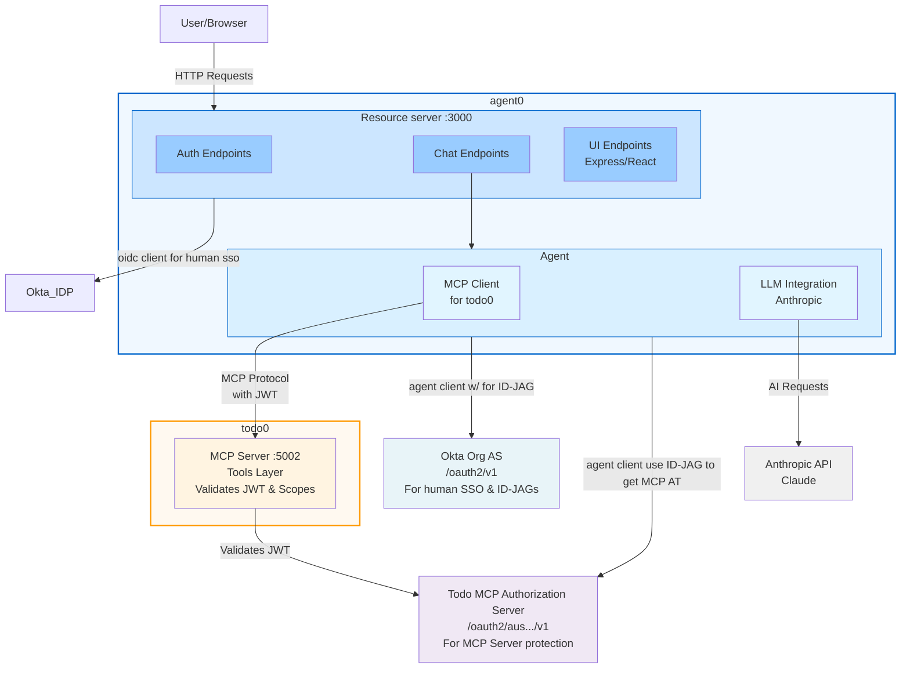

<div align="center">

#  Okta Secure AI Agent Example

[](https://www.typescriptlang.org/)
[](https://nodejs.org/)
[](https://pnpm.io/)
[](https://openid.net/connect/)
[](https://modelcontextprotocol.io/)
[](https://opensource.org/licenses/ISC)

</div >

## Overview

This monorepo demonstrates an agentic application (agent0) that has a secure integration with another application's (todo0) MCP exposed resources.


### Architecture



**Port Configuration:**

- agent0 Application: Port 3000
  - **agent0 Resource Server** (Human-Facing Services):
    - Auth Endpoints: Handle authentication flows
    - UI Endpoints: Serve React application (Express)
    - Chat Endpoints: Handle user chat interactions
    - OIDC Client (Linked App): Manages user OAuth authentication with **Okta Org AS** (`/oauth2/v1`)
  - **agent0 Agent Identity** (Registered agent in Okta):
    - MCP Client: Connects to todo0's MCP Server
    - LLM Integration: Interfaces with Anthropic's Claude API
    - Authenticates with **Okta Org AS** (`/oauth2/v1`) using Client Credentials to request ID-JAG
    - Authenticates with **Todo MCP Authorization Server** using JWT Bearer grant to exchange ID-JAG for MCP access token
- todo0 Package: Port 5002 (MCP Server)
  - **Todo MCP Server**: Tools layer for todo operations (Express + Prisma)
  - Validates JWTs issued by **Todo MCP Authorization Server**
  - Validates scopes (`mcp:connect`, `mcp:tools:read`, `mcp:tools:manage`) for authorization

**Okta Authorization Servers:**

- **Okta Org AS** (`/oauth2/v1`): Used for human SSO (Single Sign-On) and ID-JAG issuance
  - Handles user authentication for the OIDC Client
  - Issues tokens for human users accessing the Resource Server
  - Issues ID-JAG tokens for Agent Identity via Client Credentials flow
- **Todo MCP Authorization Server** (Custom AS): Used for MCP Server protection
  - Exchanges ID-JAG tokens for MCP-scoped access tokens via JWT Bearer grant
  - Issues tokens that todo0's MCP Server validates
  - Provides fine-grained authorization with MCP-specific scopes

**Architecture Flow:**

- Users interact with the Resource Server's UI, Auth, and Chat endpoints
- The Resource Server uses the Agent Identity to process AI-powered requests
- **Human Authentication**: The OIDC Client authenticates users via **Okta Org AS** (`/oauth2/v1`)
- **Agent Authentication**:
  1. Agent Identity obtains ID-JAG token from **Okta Org AS** via Client Credentials flow
  2. Agent Identity exchanges ID-JAG for MCP access token from **Todo MCP Authorization Server** via JWT Bearer grant
- The MCP Client (within Agent Identity) communicates with todo0's MCP Server on port 5002 using the MCP access token
- The todo0 MCP Server validates JWTs and scopes issued by **Todo MCP Authorization Server**
- The LLM Integration enables Claude AI capabilities for chat and agent operations

### Features

- MCP server with tools for managing todos
- MCP client for interacting with the MCP server
- Okta OAuth2 authentication with ID-JAG token exchange
- JWT validation and scope-based authorization
- pnpm workspace structure

## Packages

- `agent0`: Contains the MCP client implementation with Anthropic Claude integration
- `todo0`: Contains the MCP server with Express/Prisma backend

## Setup

### Prerequisites

Before running the bootstrap script, you'll need:

1. **Okta Developer Account**
   - Sign up for free at [https://developer.okta.com/signup/](https://developer.okta.com/signup/)

2. **Okta API Token** with admin permissions
   - Create via: Okta Admin Console → Security → API → Tokens → Create Token

3. **Anthropic API Key** (optional, for LLM integration)
   - Sign up at [https://console.anthropic.com/](https://console.anthropic.com/)
   - Alternative: Configure AWS Bedrock credentials instead
   - **Note** These will need to be configured in packages/agent0/.env.agent at a later step.

### Automated Configuration

Run the interactive bootstrap script to automatically configure your Okta tenant and generate all required configuration files:

```sh
pnpm run bootstrap:okta
```

**The script will prompt you for:**

- Okta domain (e.g., dev-12345.okta.com)
- Okta API token
- Audience values for each authorization server (or use defaults)
- Owner setup method (Standard API recommended)

**What gets automatically created:**

**In Okta:**

- 1 Authorization Server (Todo MCP Authorization Server)
- Custom scopes for MCP Server:
  - `mcp:connect` - Establish MCP connection
  - `mcp:tools:read` - Use tools that read todo data
  - `mcp:tools:manage` - Use tools that manage todo data
- 2 OIDC Applications (agent0 web app, todo0 web app)
- Agent Identity with RSA key pair for workload authentication
- Agent Connection to Todo MCP Authorization Server
- Access policies and rules with JWT Bearer grant type
- 2 Trusted Origins (ports 3000, 5002)
- User assignment to both OIDC applications

**Locally:**

- `packages/agent0/.env.app` - Agent0 resource server configuration
- `packages/agent0/.env.agent` - Agent0 agent identity configuration with MCP settings
- `packages/todo0/.env` - Todo0 MCP server configuration
- `packages/agent0/agent0-private-key.pem` - RSA private key (600 permissions)
- `okta-config-report.md` - Detailed configuration report
- `.okta-bootstrap-state.json` - State file for rollback

### Verification

After bootstrap completes, verify your configuration:

```sh
pnpm run validate:okta
```

This runs automated checks to ensure:

- All .env files exist with required variables
- Authorization servers are reachable
- Private key is valid
- ID-JAG token exchange flow works
- Audiences are properly separated

### Rollback

To completely remove all Okta resources and local files created by bootstrap:

```sh
pnpm run rollback:okta
```

This will:

- Delete all authorization servers, applications, and agent identities from Okta
- Remove trusted origins
- Optionally delete local .env files and private keys
- Clean up the state file

### Manual Configuration

If you prefer to manually configure Okta and create your own .env files, refer to the `.env.example` files in each package:

- `packages/agent0/.env.agent.example`
- `packages/agent0/.env.app.example`
- `packages/todo0/.env.example`

## Install & build

### 1. Install dependencies

```sh
pnpm install
```

### 2. Approve builds & build

```sh
pnpm approve-builds
```

### 3. Init prisma client

```sh
pnpm init:prisma
```

### 4. Build

```sh
pnpm build
```

## 6. Make sure env files are correct

If you used `pnpm run bootstrap:okta`, then your .env files are 99% ready to go.

**Note** make sure that you update packages/agent0/.env.agent with either the anthropic keys and values or the aws bedrock keys and values so the agent can interact with an LLM. Comment out the set of key value pairs you are not using.

## Running the demo services

### 7. Start todo0 MCP server

```sh
pnpm run start:mcp
```

### 8. Start agent0 application

```sh
pnpm run start:agent0
```

## Notes

- See each package's README or source for more details and customization.
