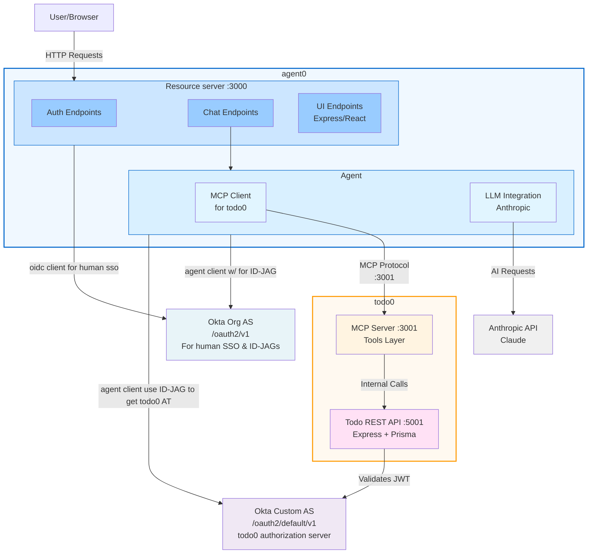

<div align="center">

#  Okta Secure AI Agent Example

[](https://www.typescriptlang.org/)
[](https://nodejs.org/)
[](https://pnpm.io/)
[](https://openid.net/connect/)
[](https://modelcontextprotocol.io/)
[](https://opensource.org/licenses/ISC)

</div >

### Architecture



**Port Configuration:**

- agent0 Application: Port 3000
  - **agent0 Resource Server** (Human-Facing Services):
    - Auth Endpoints: Handle authentication flows
    - UI Endpoints: Serve React application (Express)
    - Chat Endpoints: Handle user chat interactions
    - OIDC Client (Linked App): Manages user OAuth authentication with **Okta Org AS** (`/oauth2/v1`)
  - **agent0 Agent Identity** (Registered agent in Okta):
    - MCP Client: Connects to todo0's MCP Server
    - LLM Integration: Interfaces with Anthropic's Claude API
    - Authenticates with **Okta Custom AS** (`/oauth2/default/v1`) using Client Credentials
- todo0 Package: Port 5001 (API) / Port 3001 (MCP Server)
  - **Todo MCP Server**: Tools layer for todo operations
  - **Todo REST API**: Express + Prisma backend
  - Protected by **Okta Custom AS** (`/oauth2/default/v1`) - validates JWTs from the Custom AS

**Okta Authorization Servers:**

- **Okta Org AS** (`/oauth2/v1`): Used for human SSO (Single Sign-On)
  - Handles user authentication for the OIDC Client
  - Issues tokens for human users accessing the Resource Server
- **Okta Custom AS** (`/oauth2/default/v1`): Used for API protection and service-to-service auth
  - Handles Agent Identity authentication via Client Credentials flow
  - Issues tokens that todo0's MCP Server validates
  - Provides fine-grained authorization for API resources

**Architecture Flow:**

- Users interact with the Resource Server's UI, Auth, and Chat endpoints
- The Resource Server uses the Agent Identity to process AI-powered requests
- **Human Authentication**: The OIDC Client authenticates users via **Okta Org AS** (`/oauth2/v1`) and shares ID tokens with the Agent Identity
- **Service Authentication**: The Agent Identity authenticates as a workload principal with the **Okta Custom AS** (`/oauth2/default/v1`) via Client Credentials flow
- The MCP Client (within Agent Identity) communicates with todo0's MCP Server on port 3001
- The todo0 MCP Server validates JWTs issued by **Okta Custom AS** (`/oauth2/default/v1`)
- The LLM Integration enables Claude AI capabilities for chat and agent operations

### Features

- RESTful todo API with authentication (Express + Prisma)
- MCP server with tools for managing todos (create, list, update, complete, delete)
- MCP client for interacting with the MCP server
- Okta OAuth2 authentication
- pnpm workspace structure

## Packages

- `agent0`: Contains the MCP client implementation with Anthropic Claude integration
- `todo0`: Contains the MCP server, Express/Prisma REST API, and web UI

## MCP Server Tools

- `create-todo`: Create a new todo (requires create:todos scope)
- `get-todos`: List todos (admins see all, users see own)
- `update-todo`: Edit the title/content of a todo
- `toggle-todo`: Toggle the completed status of a todo
- `delete-todo`: Delete a todo (own todos or admin access)

## Run Instructions

### Install dependencies

```sh
pnpm install
```

### Bootstrap prisma client

```sh
pnpm boostrap
```

### Start REST API (todo0)

```sh
pnpm run start:todo0
```

### Start MCP Server (todo0)

```sh
pnpm run start:mcp
```

### Start MCP Client (agent0)

```sh
pnpm run start:client0
```

## Environment Variables

Each package has its own `.env.example` file. Copy it to `.env` and configure with your values.

### agent0 Environment Variables

**MCP Client Configuration:**

- `ANTHROPIC_API_KEY`: Your Anthropic API key
- `ANTHROPIC_MODEL`: Claude model to use (default: claude-3-5-sonnet-20241022)

**Okta OAuth Configuration:**

- `OKTA_DOMAIN`: Your Okta domain (e.g., dev-12345.okta.com)
- `OKTA_CLIENT_ID`: OAuth client ID for user authentication
- `OKTA_CLIENT_SECRET`: OAuth client secret
- `OKTA_REDIRECT_URI`: OAuth callback URL
- `MCP_SERVER_URL`: URL to the MCP server (default: <http://localhost:3001/sse>)

### todo0 Environment Variables

**REST API Configuration:**

- `PORT`: API server port (default: 5001)
- `OKTA_ISSUER`: Okta issuer URL for JWT validation
- `OKTA_CLIENT_ID`: OAuth client ID
- `EXPECTED_AUDIENCE`: Expected audience in JWT validation (default: api://default)

**MCP Server Configuration:**

- `TODO_API_BASE_URL`: Base URL for the todo API (default: <http://localhost:5001>)
- `TODO_ACCESS_TOKEN`: Access token for todo API authentication

## Notes

- See each package's README or source for more details and customization.
