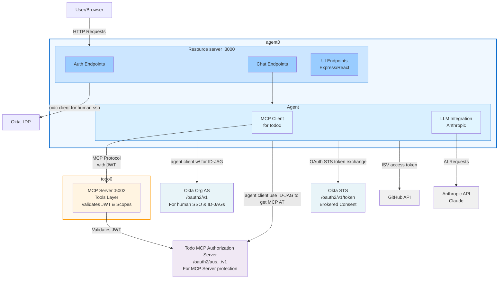

<div align="center">

#  Okta Secure AI Agent Example

[](https://www.typescriptlang.org/)
[](https://nodejs.org/)
[](https://pnpm.io/)
[](https://openid.net/connect/)
[](https://modelcontextprotocol.io/)
[](https://opensource.org/licenses/ISC)

</div >

> [!CAUTION]
> This repo requires the **SECURE_AI SKU** to be enabled for your Okta org in order to test the offering. To enable it, work with your Okta account manager.
> For more details, see: <https://support.okta.com/help/s/article/okta-secures-ai>

## Overview

This monorepo demonstrates an agentic application (agent0) that has a secure integration with another application's (todo0) MCP exposed resources.


### Architecture


```mermaid
graph TB
    User[User/Browser]
    Anthropic[Anthropic API<br/>Claude]
    Okta_Org_AS[Okta Org AS<br/>/oauth2/v1<br/>For human SSO & ID-JAGs]
    Okta_IDP
    Okta_MCP_AS[Todo MCP Authorization Server<br/>/oauth2/aus.../v1<br/>For MCP Server protection]
    Okta_STS[Okta STS<br/>/oauth2/v1/token<br/>Brokered Consent]
    GitHub[GitHub API]

    subgraph Agent0[agent0]
        subgraph ResourceServer[Resource server :3000]
            Auth[Auth Endpoints]
            Chat[Chat Endpoints]
            UI[UI Endpoints<br/>Express/React]
        end

        subgraph AgentIdentity[Agent]
            MCP_Client[MCP Client<br/>for todo0]
            LLM_Integration[LLM Integration<br/>Anthropic]
        end
    end

    subgraph Todo0[todo0]
        MCP_Server[MCP Server :5002<br/>Tools Layer<br/>Validates JWT & Scopes]
    end

    User -->|HTTP Requests| ResourceServer
    ResourceServer-->|oidc client for human sso| Okta_IDP
    LLM_Integration -->|AI Requests| Anthropic
    AgentIdentity -->| agent client w/ for ID-JAG | Okta_Org_AS
    AgentIdentity -->| agent client use ID-JAG to get MCP AT | Okta_MCP_AS
    MCP_Client -->|MCP Protocol<br/>with JWT| MCP_Server
    MCP_Server -->|Validates JWT| Okta_MCP_AS
    Chat-->AgentIdentity
    AgentIdentity -->|OAuth STS token exchange| Okta_STS
    AgentIdentity -->|ISV access token| GitHub

    style Auth fill:#99ccff
    style UI fill:#99ccff
    style Chat fill:#99ccff
    style MCP_Client fill:#e1f5ff
    style LLM_Integration fill:#e1f5ff
    style MCP_Server fill:#fff4e1
    style Okta_Org_AS fill:#e8f4f8
    style Okta_MCP_AS fill:#f0e8f4
    style Anthropic fill:#f0f0f0
    style ResourceServer fill:#cce6ff,stroke:#0066cc,stroke-width:1px
    style AgentIdentity fill:#d9f0ff,stroke:#0066cc,stroke-width:1px
    style Agent0 fill:#f0f8ff,stroke:#0066cc,stroke-width:2px
    style Okta_STS fill:#e8f4f8
    style GitHub fill:#f0f0f0
    style Todo0 fill:#fff9f0,stroke:#ff9900,stroke-width:2px
```

**Port Configuration:**

- agent0 Application: Port 3000
  - **agent0 Resource Server** (Human-Facing Services):
    - Auth Endpoints: Handle authentication flows
    - UI Endpoints: Serve React application (Express)
    - Chat Endpoints: Handle user chat interactions
    - OIDC Client (Linked App): Manages user OAuth authentication with **Okta Org AS** (`/oauth2/v1`)
  - **agent0 Agent Identity** (Registered agent in Okta):
    - MCP Client: Connects to todo0's MCP Server
    - LLM Integration: Interfaces with Anthropic's Claude API
    - Authenticates with **Okta Org AS** (`/oauth2/v1`) using Client Credentials to request ID-JAG
    - Authenticates with **Todo MCP Authorization Server** using JWT Bearer grant to exchange ID-JAG for MCP access token
- todo0 Package: Port 5002 (MCP Server)
  - **Todo MCP Server**: Tools layer for todo operations (Express + Prisma)
  - Validates JWTs issued by **Todo MCP Authorization Server**
  - Validates scopes (`mcp:connect`, `mcp:tools:read`, `mcp:tools:manage`) for authorization

**Okta Authorization Servers:**

- **Okta Org AS** (`/oauth2/v1`): Used for human SSO (Single Sign-On) and ID-JAG issuance
  - Handles user authentication for the OIDC Client
  - Issues tokens for human users accessing the Resource Server
  - Issues ID-JAG tokens for Agent Identity via Client Credentials flow
- **Todo MCP Authorization Server** (Custom AS): Used for MCP Server protection
  - Exchanges ID-JAG tokens for MCP-scoped access tokens via JWT Bearer grant
  - Issues tokens that todo0's MCP Server validates
  - Provides fine-grained authorization with MCP-specific scopes

**Architecture Flow:**

- Users interact with the Resource Server's UI, Auth, and Chat endpoints
- The Resource Server uses the Agent Identity to process AI-powered requests
- **Human Authentication**: The OIDC Client authenticates users via **Okta Org AS** (`/oauth2/v1`)
- **Agent Authentication**:
  1. Agent Identity obtains ID-JAG token from **Okta Org AS** via Client Credentials flow
  2. Agent Identity exchanges ID-JAG for MCP access token from **Todo MCP Authorization Server** via JWT Bearer grant
- The MCP Client (within Agent Identity) communicates with todo0's MCP Server on port 5002 using the MCP access token
- The todo0 MCP Server validates JWTs and scopes issued by **Todo MCP Authorization Server**
- The LLM Integration enables Claude AI capabilities for chat and agent operations
- **Third-Party Access (OAuth STS)**: Agent exchanges user's ID token via Okta STS for an ISV access token. First request triggers user consent (`interaction_required`), subsequent requests return cached token. Currently used for GitHub API access.

### Features

- MCP server with tools for managing todos
- MCP client for interacting with the MCP server
- Okta OAuth2 authentication with ID-JAG token exchange
- JWT validation and scope-based authorization
- OAuth STS brokered consent for third-party integrations (e.g., GitHub)
- **Multi-MCP**: agent0 connects to Todo0 and GitHub MCP servers concurrently, each with its own auth strategy
- **Managed Connections panel**: live view of every Okta-managed connection wired on the agent
- pnpm workspace structure

## Managed Connections

Okta defines five "managed-connection" types an AI agent can own. This sample
wires up **three of them** — the set that maps cleanly to an end-to-end
secure-agent story — and surfaces their live status in an in-app panel.

| Kind | Okta admin label | Purpose | "Live" means |
|------|------------------|---------|--------------|
| `authorization_server` | Authorization Server | Okta Org AS that issues ID-JAGs for the agent | At least one ID-JAG-authed MCP session is connected |
| `application` | Application | Brokered consent via Okta STS for 3rd-party ISVs (e.g., GitHub REST API) | User has completed consent at least once this process lifetime |
| `mcp_server` | MCP Server | An MCP server registered in Okta (Todo0, GitHub MCP) | The MCP session handshake succeeded |

`secret` and `service_account` are intentionally out of scope for this sample.

### Multi-MCP support

agent0 talks to multiple MCP servers in the same chat turn. Each server picks
the auth strategy that matches its deployment:

| MCP server | URL | Auth strategy |
|------------|-----|---------------|
| Todo0 MCP Server | `http://localhost:5002/mcp` | ID-JAG → MCP access token (Okta Org AS → custom AS) |
| GitHub MCP Server | `https://api.githubcopilot.com/mcp/` | OAuth STS brokered consent (Okta STS → ISV access token) |

Auth strategies are defined in
`packages/agent0/src/connections/auth-strategy.ts`. Registering a new MCP
server is a matter of adding one entry plus its strategy; the Connections
panel picks it up automatically via `GET /api/connections/status`.

### Connections panel

Click the 🔗 button in the header to open the panel. Each card shows:

- Connection kind + instance name (e.g. `Todo0 MCP Server`, `Github MCP Server`)
- Status chip — `LIVE` / `IDLE` / `DISABLED`
- Key identifiers (AS URL, agent ID, resource indicator, MCP URL, Okta registration ID)

The panel is backed by a single endpoint:

```
GET /api/connections/status
```

which aggregates per-kind status builders in
`packages/agent0/src/connections/registry.ts`.


## Packages

- `agent0`: Contains the MCP client implementation with Anthropic Claude integration
- `todo0`: Contains the MCP server with Express/Prisma backend

## Setup

### Prerequisites

Before running the bootstrap script, you'll need:

1. **Node.js 19 or later**
   - Download from [https://nodejs.org/](https://nodejs.org/)
   - Verify installation: `node --version`

2. **pnpm 8 or later**
   - Install via Homebrew (macOS): `brew install pnpm`
   - Or Install via npm: `npm install -g pnpm`
   - Or via standalone script: `curl -fsSL https://get.pnpm.io/install.sh | sh -`
   - Verify installation: `pnpm --version`

3. **Okta Developer Account**
   - Sign up for free at [https://developer.okta.com/signup/](https://developer.okta.com/signup/)

4. **Okta API Token** with admin permissions
   - Create via: Okta Admin Console → Security → API → Tokens → Create Token

5. **Anthropic API Key** (optional, for LLM integration)
   - Sign up at [https://console.anthropic.com/](https://console.anthropic.com/)
   - Alternative: Configure AWS Bedrock credentials instead
   - **Note** These will need to be configured in packages/agent0/.env.agent at a later step.

6. **Okta Feature Flags** (optional, for GitHub integration via OAuth STS)
   - `SECURE_AI_AGENTS` and `SECURE_AI_OAUTH_STS` must be enabled on your Okta org
   - An ISV app (e.g., GitHub) from the OIN catalog with Resource Server tab configured
   - A managed connection on the AI agent pointing to the ISV app
   - See Okta OAuth STS documentation for setup details

### Automated Configuration

Run the interactive bootstrap script to automatically configure your Okta tenant and generate all required configuration files:

```sh
pnpm install
pnpm run bootstrap:okta
```

**The script will prompt you for:**

- Okta domain (e.g., dev-12345.okta.com)
- Okta API token
- Audience values for each authorization server (or use defaults)
- Owner setup method (Standard API recommended)

**What gets automatically created:**

**In Okta:**

- 1 Authorization Server (Todo MCP Authorization Server)
- Custom scopes for MCP Server:
  - `mcp:connect` - Establish MCP connection
  - `mcp:tools:read` - Use tools that read todo data
  - `mcp:tools:manage` - Use tools that manage todo data
- 2 OIDC Applications (agent0 web app, todo0 web app)
- Agent Identity with RSA key pair for workload authentication
- Agent Connection to Todo MCP Authorization Server
- Access policies and rules with JWT Bearer grant type
- 2 Trusted Origins (ports 3000, 5002)
- User assignment to both OIDC applications

**Locally:**

- `packages/agent0/.env.app` - Agent0 resource server configuration
- `packages/agent0/.env.agent` - Agent0 agent identity configuration with MCP settings
- `packages/todo0/.env.app` - Todo0 app server configuration
- `packages/todo0/.env.mcp` - Todo0 MCP server configuration
- `packages/agent0/agent0-private-key.pem` - RSA private key (600 permissions)
- `okta-config-report.md` - Detailed configuration report
- `.okta-bootstrap-state.json` - State file for rollback

### Verification

After bootstrap completes, verify your configuration:

```sh
pnpm run validate:okta
```

This runs automated checks to ensure:

- All .env files exist with required variables
- Authorization servers are reachable
- Private key is valid
- ID-JAG token exchange flow works
- Audiences are properly separated

### Rollback

To completely remove all Okta resources and local files created by bootstrap:

```sh
pnpm run rollback:okta
```

This will:

- Delete all authorization servers, applications, and agent identities from Okta
- Remove trusted origins
- Optionally delete local .env files and private keys
- Clean up the state file

### Manual Configuration

If you prefer to manually configure Okta and create your own .env files, refer to the `.env.example` files in each package:

- `packages/agent0/.env.agent.example`
- `packages/agent0/.env.app.example`
- `packages/todo0/.env.app.example`
- `packages/todo0/.env.mcp.example`

## Install & build

### 1. Install dependencies

```sh
pnpm install
```

### 2. Init prisma client

```sh
pnpm init:prisma
```

### 3. Build

```sh
pnpm build
```

### 4. Make sure env files are correct

If you used `pnpm run bootstrap:okta`, then your .env files are 99% ready to go.

**Note** make sure that you update packages/agent0/.env.agent with either the anthropic keys and values or the aws bedrock keys and values so the agent can interact with an LLM. Comment out the set of key value pairs you are not using.

**Optional** To enable GitHub integration via OAuth STS brokered consent, set `OAUTH_STS_RESOURCE` in `packages/agent0/.env.agent` to the Resource Indicator URI from your managed connection (Directory > AI Agents > {Agent} > Managed connections > Resource Indicator).

## Running the demo services

Start all services together:

```sh
pnpm run dev
```

Or run individually in separate terminals:

```sh
pnpm run start:todo0   # Start todo0 app server (port 5001)
pnpm run start:mcp     # Start todo0 MCP server (port 5002)
pnpm run start:agent0  # Start agent0 application (port 3000)
```

## Try it out

Open <http://localhost:3000>, log in with Okta, then open the Managed
Connections panel (🔗 in the header) in a second pane so you can watch the
connection cards flip between `IDLE` and `LIVE` as each auth flow fires.

The prompts below are grouped by the Okta capability they exercise. Run them
top-to-bottom — each one leans on the context established by the previous.

### 1. ID-JAG → MCP access token (Todo0)

The agent exchanges your ID token for an **ID-JAG** at Okta Org AS, then
exchanges the ID-JAG for an MCP-scoped access token at the custom Todo MCP
Authorization Server. The MCP server validates the JWT + scopes before
serving any tool.

Try:

```
list my todos
```
```
add a todo "prep the Okta demo"
```
```
mark todo 2 as done
```

**What to look for:**
- `Authorization Server` card → `LIVE`
- `Todo0 MCP Server` card → `LIVE`
- Expand the tool-call chip above each reply to see the raw MCP tool
  arguments and result JSON.

### 2. Step-up auth (expanded MCP scopes)

Some MCP tools require a broader scope than the initial session holds. When
the MCP server returns `insufficient_scope`, the agent silently re-runs the
ID-JAG → MCP access token exchange with the extra scope and retries the
tool. No user interaction needed.

Try (right after step 1):

```
delete todo 3
```

**What to look for:**
- A second tool chip appears for the retry. The first chip shows the
  `insufficient_scope` challenge; the second shows the tool succeeding after
  the expanded-scope access token is obtained.

### 3. OAuth STS brokered consent (GitHub)

> Requires `OAUTH_STS_RESOURCE` to be set in `packages/agent0/.env.agent`
> and a managed connection to GitHub configured in Okta.

The agent exchanges your ID token at Okta STS for a GitHub access token.
The **first** exchange returns `interaction_required` — the UI shows a
consent card linking to the ISV consent page. After consent, the retry
succeeds and GitHub is called on your behalf.

Try:

```
comment "LGTM" on https://github.com/<your-org>/<your-repo>/pull/1
```

**What to look for:**
- First turn: a consent card appears in chat with a link to the GitHub
  consent screen. Complete consent in a new tab.
- After consent: the turn completes, the GitHub API call runs, and the
  `OAuth STS Application` + `Github MCP Server` cards flip to `LIVE`.
- The cached ISV token survives until its TTL; subsequent PR-comment
  prompts run without a second consent prompt.

## Notes

- See each package's README or source for more details and customization.
